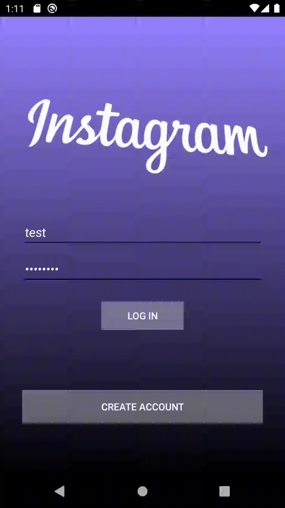
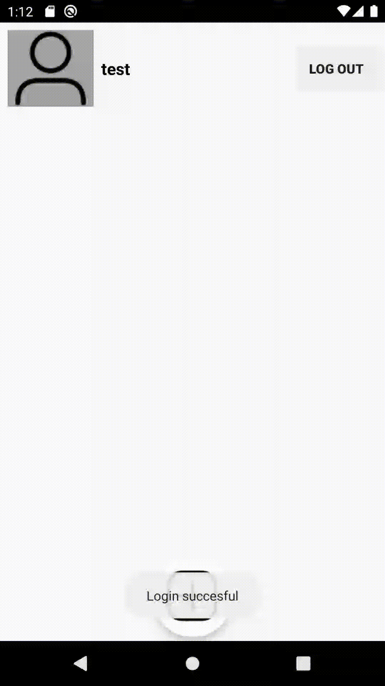

# Project 3 - ***Instagram-Clone*

**Instagram-Clone-Codepath** is a photo sharing app similar to Instagram but using Parse as its backend.

Time spent: **20** hours spent in total

## User Stories

The following **required** functionality is completed:

- [x] User can view the last 20 posts submitted to "Instagram".
- [x] The user should switch between different tabs - viewing all posts (feed view), compose (capture photos form camera) and profile tabs (posts made) using fragments and a Bottom Navigation View. (2 points)
- [x] User can pull to refresh the last 20 posts submitted to "Instagram".

The following **optional** features are implemented:

- [ ] User sees app icon in home screen and styled bottom navigation view
- [ ] Style the feed to look like the real Instagram feed.
- [ ] User can load more posts once he or she reaches the bottom of the feed using infinite scrolling.
- [ ] Show the username and creation time for each post.
- [ ] User can tap a post to view post details, including timestamp and caption.
- [ ] User Profiles
      - [ ] Allow the logged in user to add a profile photo
      - [ ] Display the profile photo with each post
      - [ ] Tapping on a post's username or profile photo goes to that user's profile page and shows a grid view of the user's posts 
- [ ] User can comment on a post and see all comments for each post in the post details screen.
- [ ] User can like a post and see number of likes for each post in the post details screen.

## Video Walkthrough

Here's a walkthrough of implemented user stories:

Here's a walkthrough of implemented user stories:

 

#Previous Version (Part 1):
## User Stories

The following **required** functionality is completed:

- [X] User can sign up to create a new account using Parse authentication.
- [X] User can log in and log out of his or her account.
- [X] The current signed in user is persisted across app restarts.
- [X] User can take a photo, add a caption, and post it to "Instagram".

The following **optional** features are implemented:

- [ ] User sees app icon in home screen and styled bottom navigation view
- [ ] Style the feed to look like the real Instagram feed.
- [ ] After the user submits a new post, show an indeterminate progress bar while the post is being uploaded to Parse.

The following **additional** features are implemented:

- [ ] List anything else that you can get done to improve the app functionality!

## Video Walkthrough

Here's a walkthrough of implemented user stories:

 

## Notes

Describe any challenges encountered while building the app.

## Open-source libraries used

- [Android Async HTTP](https://github.com/codepath/CPAsyncHttpClient) - Simple asynchronous HTTP requests with JSON parsing
- [Glide](https://github.com/bumptech/glide) - Image loading and caching library for Android
